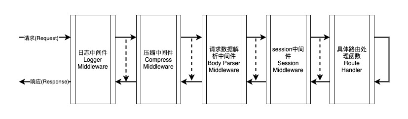

# elton-beginner

Elton的实现主要参考了[koa](https://github.com/koajs/koa)，最主要的核心就是中间件的处理。在了解如何使用elton之前，首先要了解其中间件的处理过程，主要有以下关键点：

- 处理顺序：请求时从左往右，响应时从右往左（参考示例图）
- 中间件处理失败直接返回error，如数据解析出错、Session获取失败、权限校验不通过等
- 若当前中间件认为已处理完成当前请求，则无需调用Next函数，如果未处理完成需要转给下一中间件，则调用Next
- 中间件的实现中，调用Next函数之前的代码属于请求逻辑处理（示例图的左往右的箭头部分），而Next函数之后的代码则属于响应逻辑处理（示例图右往右的箭头部分）



虚线箭头表示当该中间件不调用Next函数时的逻辑


## 中间件串联


```go
package main

import (
	"bytes"
	"fmt"
	"time"

	"github.com/vicanso/elton"
)

func main() {
	e := elton.New()
	responseTimeKey := "responseTime"
	// 日志
	e.Use(func(c *elton.Context) error {
		// 转至下一个处理函数(或中间件)
		err := c.Next()
		fmt.Println(fmt.Sprintf("%s %s - %s", c.Request.Method, c.Request.RequestURI, c.GetDuration(responseTimeKey)))
		return err
	})
	// 响应时间
	e.Use(func(c *elton.Context) error {
		// 记录开始时间
		start := time.Now()
		err := c.Next()
		// 根据开始时间计算响应时长
		c.Set(responseTimeKey, time.Since(start))
		return err
	})
	// /ping url的具体处理
	e.GET("/ping", func(c *elton.Context) error {
		c.Body = bytes.NewBufferString("pong")
		return nil
	})
	// 监听端口
	err := e.ListenAndServe(":7001")
	if err != nil {
		panic(err)
	}
}
```

如上代码所实现了两个中间件：日志记录与响应时长计算，代码的处理逻辑非常简单，仅需要考虑处理代码是在Next之前或之后。